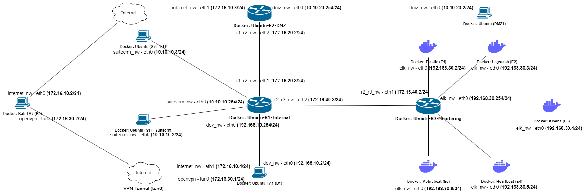

# Setup Environment
1. Virtualbox
2.Vagrant Version: Vagrant 2.3.0 s

```bash
vagrant plugin list
vagrant plugin install vagrant-docker-compose
```

# Running vagrant
```bash
# Start Vagrantfile
vagrant up
vagrant up <name|id>

# SSH into machine
vagrant ssh 
vagrant ssh <name|id>

# Destroy vagrant
vagrant destroy

# Reload Vagrantfile
vagrant reload
vagrant reload --provision
```

# Network w/ Docker Topology Setup
```bash
docker builder prune
docker container prune
docker network prune

chmod +x setup.sh ping_test.sh teardown.sh

# Setup networking for containers - includes docker compose up -d
sudo ./setup.sh

# Run ping test
sudo ./ping_test.sh

# Teardown - includes docker compose down at the end
sudo ./teardown.sh

# Utility
## Testing r1 routing
### TCP dump in r1
sudo docker exec -it r1 bash
tcpdump -i any

### Ping c1 to c2 and observe tcpdump in r1
sudo docker exec -it c1 ping -c 4 192.168.10.2
```

# Network Topology
