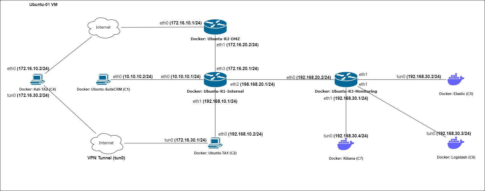

# ICT3204

## Setup Environment
1. Virtualbox
2. Vagrant Version: Vagrant 2.3.0
s
```bash
vagrant plugin list
vagrant plugin install vagrant-docker-compose
```

## Running vagrant
```bash
# Start Vagrantfile
vagrant up
vagrant up <name|id>

# SSH into machine
vagrant ssh 
vagrant ssh <name|id>

# Destroy vagrant
vagrant destroy

# Reload Vagrantfile
vagrant reload
vagrant reload --provision
```

## Network Topology


TA1:
- Linux Kernel 5.11: CVE-2022-0847 
- SuiteCRM v7.11.15: CVE-2020-28328
- SuiteCRM Credentials: `admin:admin`
